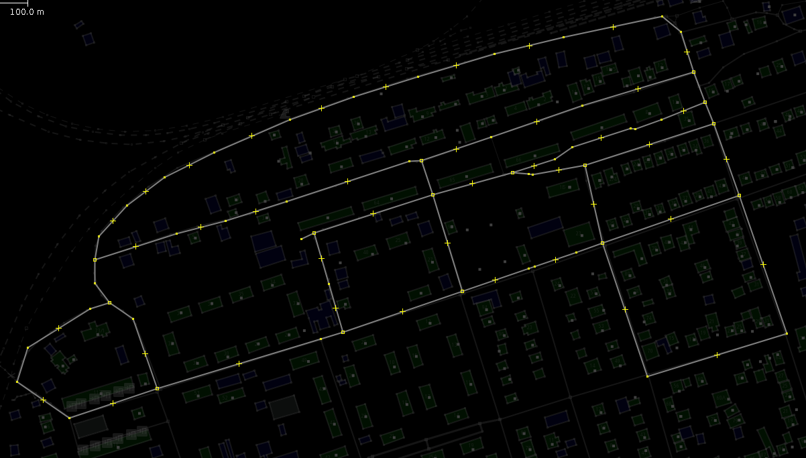
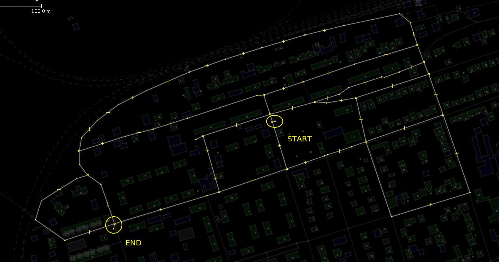
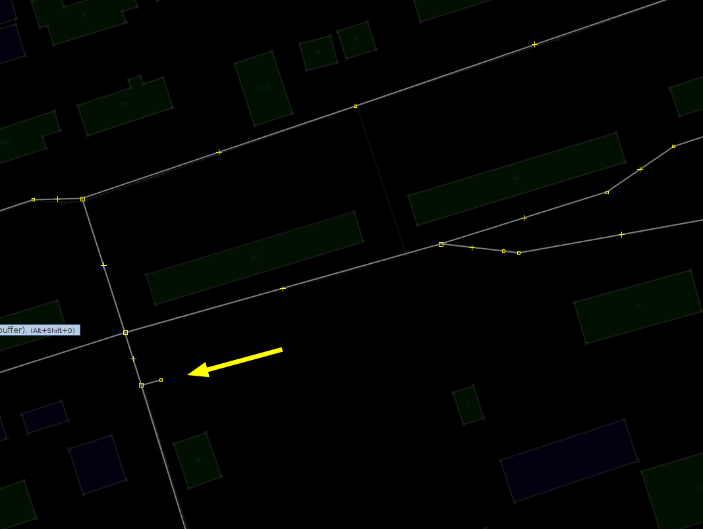

# Usage

## JOSM layer preparation
1) Add new layer in JOSM and draw ways to you want to walk through



2) Add starting and ending points as spurs. Click on starting point, select 
View - Advanced Info form JOSM menu and write down its ID. Repeat the same for
ending point. You will need them later.



IMPORTANT: Both start and end points must be connected using exactly one line only,
i.e. nothing should pass through them

3) Save layer to osm file

## Conversion to CSV and GPX

1) Run 
```
python osm2csv.py <osmfile> <csvfile>
```
where 
 - *osmfile* is path to osm file saved on step 3 of previous section
 - *csvfile* is path to output csv file to produce

This command will produce a CSV file with graph information and edge distances

---

2) Run  
```
python cpp.py <source_id> <destination_id> <csvfile> --gpx <gpxfile>
```
where
- *source_id* is the id of starting point you wrote down on step 2 of previous section
- *destination_id* is the id of ending point you wrote down on step 2 of previous section
- *csvfile* is path to CSV file you produced on previous step
- *gpxfile* is name of GPX file to produce

Viola, you can now import GPX track into your navigator and start surveying the
territory.
